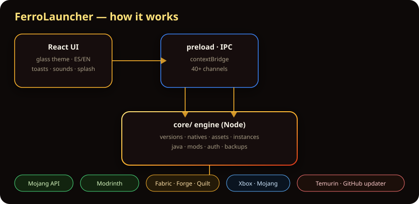
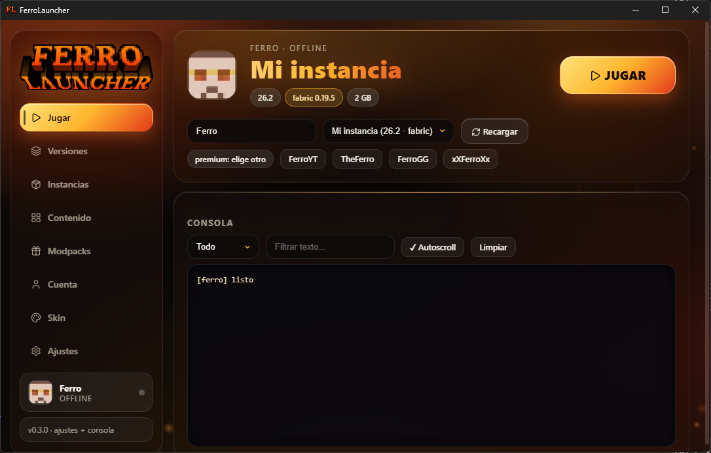
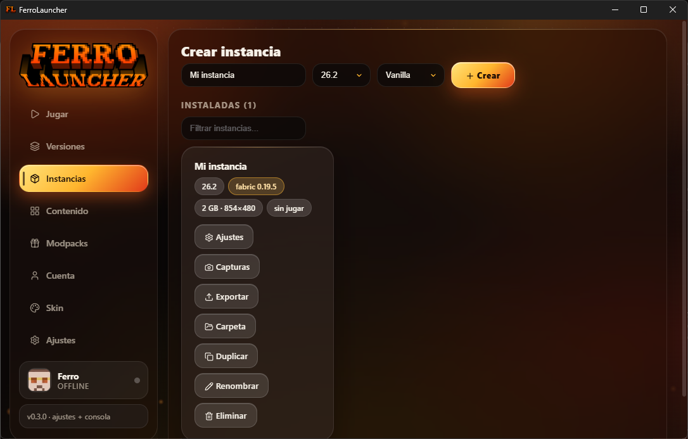
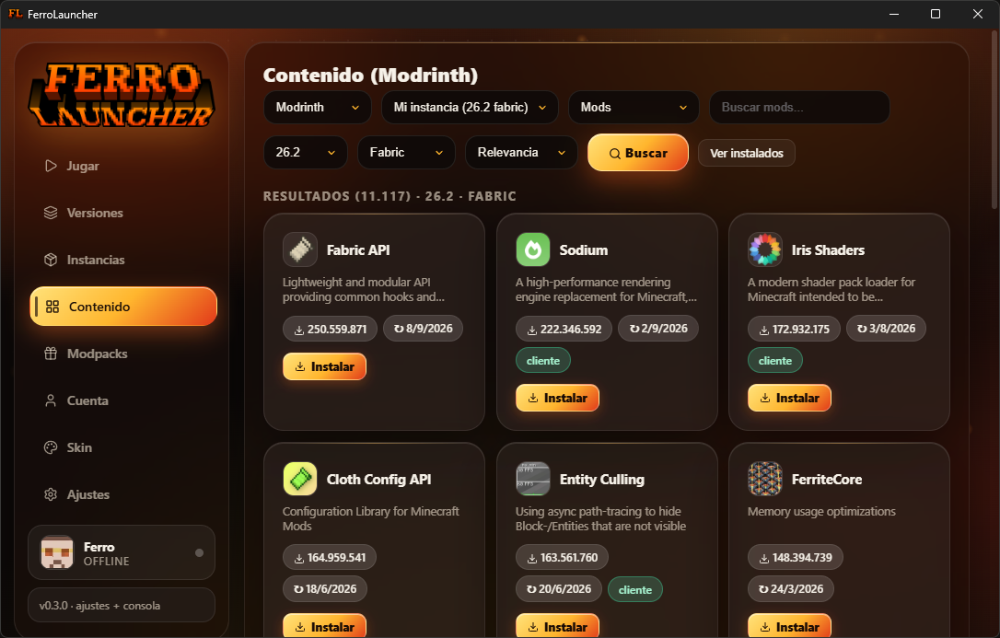
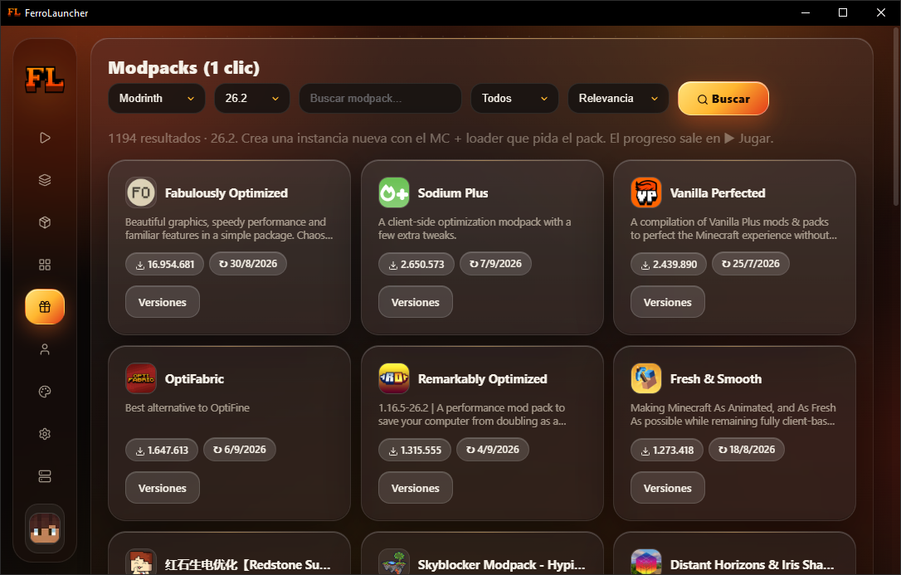

<p align="center">
  
</p>

<p align="center">
  <a href="https://github.com/4DRI4N-OFF/FerroLauncher/releases"></a>
  
  
  
  <a href="https://discord.gg/vTujTm3hE"></a>
  <a href="https://www.youtube.com/@4dri4n-08"></a>
</p>

<p align="center"><b>Open-source Minecraft: Java Edition launcher for Windows.</b><br />Instances, loaders, mods and modpacks in one place — with a glassmorphism ember UI.</p>

---

## ✨ Features

| Area | What you get |
|---|---|
| 🎮 Play | Offline + Microsoft login (OAuth 2.0 + PKCE, auto-refresh, multi-account), playtime stats |
| 🧩 Loaders | Vanilla, Fabric, Quilt, Forge, NeoForge (official installers) |
| 📦 Instances | Isolated dirs, per-instance RAM / Java / resolution, size meter + cleanup, pins, start-stop console |
| 🧪 Content | Mods, shaders, resource packs, datapacks per world + one-click `.mrpack` modpacks (Modrinth + CurseForge browsing) |
| 🔍 Browse | Results up front with pages (top + bottom), installed manager in extra window |
| 👥 Friends | Friend list with live server presence + Essential Mod panel |
| 📰 News | Live Mojang feed inside the launcher |
| 💾 Backups | Manual + automatic (daily, weekly, before playing), auto/ kept apart |
| 🎨 UI | 5 themes (Ember, Midnight, Forest, Sakura, Ancient City + Warden), ES/EN, 14 sound styles, toasts, dance mode |
| ⌨️ Shortcuts | F5 play/stop, Ctrl+1..0 tabs, Ctrl+, settings |
| ☕ Java | Auto-detects the required version, downloads Temurin when missing |
| 🛡️ Safety | Premium-name anti-impersonation, download verification, backups |
| 🔄 More | Auto-updater, skins & capes, Discord RPC + webhooks + bot announcements, crash doctor, gallery |

## 📥 Install (players)

1. Download `FerroLauncher-Setup.exe` (or `FerroLauncher-portable.exe`) from [**Releases**](https://github.com/4DRI4N-OFF/FerroLauncher/releases).
2. Run it (unsigned yet: Windows SmartScreen will warn once — click *More info → Run anyway*).
3. Create an instance and press **PLAY**. No account needed for offline.

> A Microsoft account owning Minecraft: Java Edition unlocks online servers.

## 🛠️ Dev

```powershell
npm install
npm run electron:dev     # Vite + Electron with hot reload
npm run build            # UI bundle check
npm run dist             # NSIS installer + portable .exe in release/
npm run check            # lint + core tests + landing version + build (this is what CI runs)
```

`core/` is covered by `node --test` (`npm run test`): launch arguments, zip
extraction, instance settings and the auth store. Add a test when you touch those.
`npm run lint` has a warning budget (`--max-warnings`) that may only go down, so new
silent `catch {}` blocks show up in CI instead of in a white screen.

`npm run dist:full` uses the `rcedit` devDependency (override with `FERRO_RCDIT=<path>`
if you keep your own copy).

Project layout: `core/` launcher engine (Mojang/Fabric/Modrinth/Xbox APIs) · `electron/` main + preload (IPC) · `src/` React UI.



## 🖼️ Screenshots

| Jugar | Instancias |
|---|---|
|  |  |

| Contenido | Modpacks |
|---|---|
|  |  |

> More tabs (Amigos, Datapacks, Noticias…) in the app. Fresh captures welcome via PRs!

## 🗺️ Roadmap

- [x] Offline launch (all 5 loaders) · [x] Modrinth + CurseForge content · [x] Skins, backups, multi-account
- [x] Auto-updater, icon, sounds, themes, Discord · [x] ES/EN · [x] Friends, datapacks, news, auto-backups
- [ ] Installer signing (`electron-builder` 26 ships `@electron/windows-sign`: worth a try before the custom `brand-exe` step)
- [ ] Split `src/App.jsx` per tab + `React.lazy` (single 417 kB chunk today)
- [x] CI (lint + `node --test` + Windows packaging smoke) · [x] tokens at rest via `safeStorage` · [x] Electron 44 · [x] zip extraction hardened

## 🤝 Contributing

Issues and PRs welcome (ES/EN). Keep PRs small and tested (`npm run build`). See open [issues](https://github.com/4DRI4N-OFF/FerroLauncher/issues) for ideas.

## 🙏 Acknowledgments

[Mojang](https://www.minecraft.net/) official APIs · [Modrinth](https://modrinth.com/) · [Fabric](https://fabricmc.net/), [Quilt](https://quiltmc.org/), [Forge](https://minecraftforge.net/), [NeoForge](https://neoforged.net/) · [Electron](https://www.electronjs.org/) · UI sounds synthesized in-app + [UISFX](https://uisfx.com/) (CC0) · Brand icons by [Simple Icons](https://simpleicons.org/) (CC0).

## 📄 License

MIT — see [LICENSE](LICENSE).

## ⚖️ Disclaimer

NOT AN OFFICIAL MINECRAFT PRODUCT. NOT APPROVED BY OR ASSOCIATED WITH MOJANG OR MICROSOFT.
FerroLauncher downloads game files exclusively from official Mojang/Microsoft servers and
never redistributes them. Minecraft is a trademark of Mojang Synergies AB.

## 📬 Contact

Owner: Adrián García Martínez ([@4DRI4N-OFF](https://github.com/4DRI4N-OFF)).
Issues and contact: <https://github.com/4DRI4N-OFF/FerroLauncher/issues> ·
Discord: <https://discord.gg/vTujTm3hE>.
