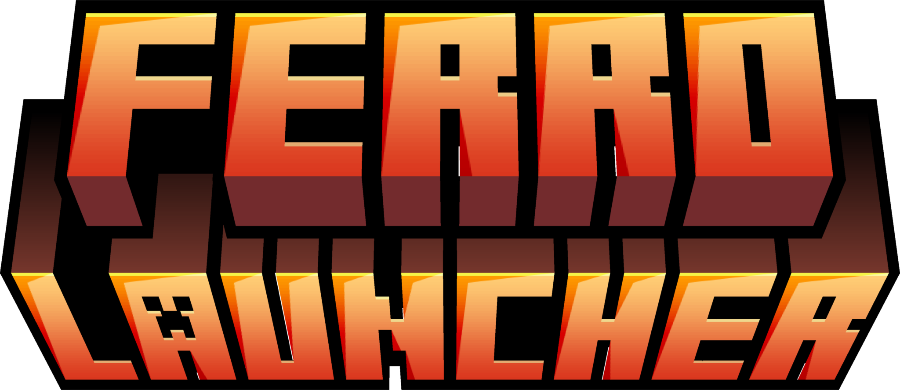

# ⛏️ FerroLauncher

<p align="center">
  
</p>

<p align="center">
  <a href="https://github.com/4DRI4N-OFF/FerroLauncher/releases"></a>
  
  
  
</p>

Open-source **Minecraft: Java Edition** launcher for Windows, built with Electron + React + Node.js.
An independent open-source launcher: instances, loaders, mods and modpacks in one place.

> ⚠️ Work in progress — not the final app. Loader and feature coverage is growing.

## Features

- **Auth:** offline mode + Microsoft-account login (OAuth 2.0 + PKCE, auto-refresh, multi-account)
- **Loaders:** Vanilla, Fabric, Quilt, Forge, NeoForge ✅
- **Instances:** isolated game dirs, per-instance RAM / Java / resolution, start-stop from console, backups, import/export
- **Content:** mods, shaders, resource packs and one-click `.mrpack` modpacks from **Modrinth**
- **Java:** auto-detects the required version, downloads Temurin when missing
- **Extras:** skins & capes, Discord Rich Presence, auto-updater, sounds, ES/EN UI

## Roadmap

- [x] Offline launch (Vanilla + Fabric + Quilt + Forge + NeoForge)
- [x] Modrinth mods, shaders, resource packs & modpacks
- [x] Microsoft login flow (pending Mojang app approval)
- [x] Auto-updater, custom icon
- [x] Skins & capes manager
- [x] Backups, instance export/import
- [x] Multi-account switcher
- [ ] CurseForge browsing, servers list
- [ ] Installer signing

## Install (users)

Download `FerroLauncher Setup x.y.z.exe` from **Releases** and run it.
No account needed for offline play; a Microsoft account with
Minecraft: Java Edition unlocks online servers.

## Dev

```powershell
npm install
npm run electron:dev     # dev UI + Electron
npm run dist             # NSIS installer + portable .exe in release/
```

## Tech

`core/` launcher engine (Mojang/Fabric/Modrinth/Xbox APIs) ·
`electron/` main + preload (IPC) · `src/` React UI.

## Contributing

Issues and PRs welcome. Keep PRs small and tested (`npm run build`).

## License

MIT — see LICENSE.

## Disclaimer

NOT AN OFFICIAL MINECRAFT PRODUCT. NOT APPROVED BY OR ASSOCIATED WITH MOJANG OR MICROSOFT.
FerroLauncher downloads game files exclusively from official Mojang/Microsoft servers and
never redistributes them. Minecraft is a trademark of Mojang Synergies AB.

## Contact

Owner: Adrián García Martínez ([@4DRI4N-OFF](https://github.com/4DRI4N-OFF)).
Issues and contact: <https://github.com/4DRI4N-OFF/FerroLauncher/issues>.
